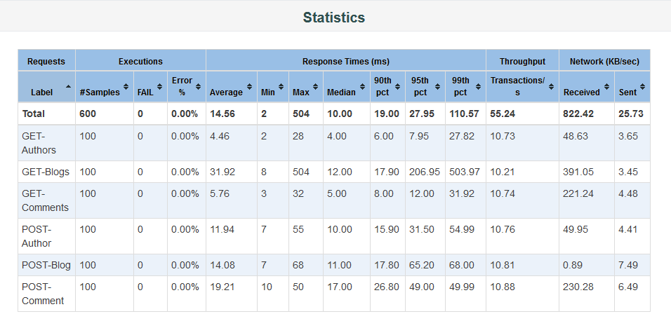
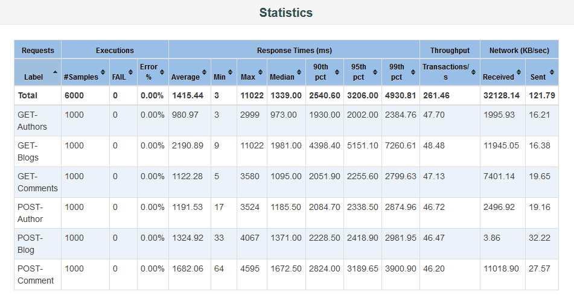
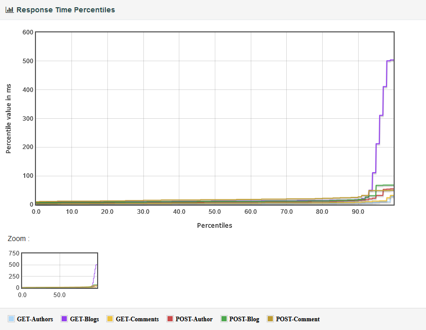
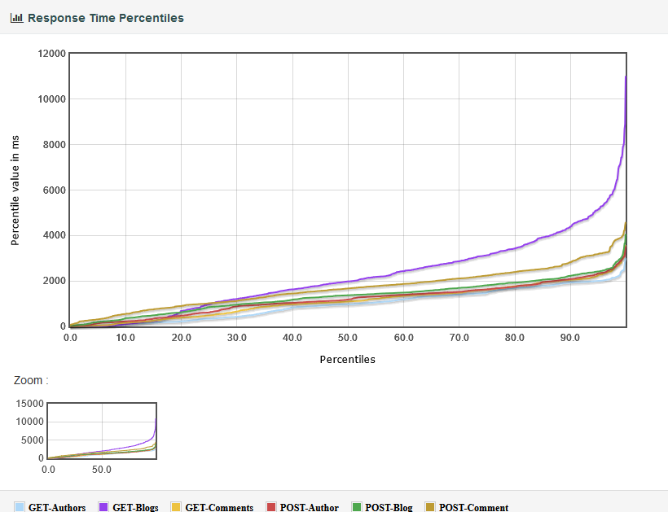

# Scope of work
- [x] Implement a load test to check how the system performs with 100+ concurrent users, which are sending HTTP requests to the backend.
- [x] Show how the test results need to be interpreted.
- [ ] Show which changes need to be done to the system to improve the results of the load test (optional).
- [x] Add enpoints for managing (at least create, read and delete, if there's enough time add update) Blogs, Comments and Authors.
- [x] Refactor the Text-Validator service to be generic.
- [x] Refactor boundry to be reactive.
    - Making the boundry resources of the REST API reactive is out of scope.

Take a look at JMeter [here](./JMeter.md).

# Load tests and reports
The load tests are located here:
- for [100 users](./load-tests/test-plans/Quarkus-API-Load-Test-100-Users.jmx)
- for [1000 users](./load-tests/test-plans/Quarkus-API-Load-Test-1000-Users.jmx)  

I tested the following endpoints:
- GET /blog
- POST /blog/{authorId}
- GET /author
- POST /author
- GET /blog/{id}/comment
- POST /blog/{id}/comment/{authorId}

The reporst are located here:
- for [100 users](./load-tests/reports/Report-100-Users-Prod/index.html)
- for [1000 users](./load-tests/reports/Report-1000-Users-Prod/index.html)  
and should be opened in a browser after locally checking out the repository.

## Interpretation

*Dashboard Statistics for 100 Users*

*Dashboard Statistics for 1000 Users*
As can be seen in the above images the difference between the `Min` and `Max` Response Times in milliseconds
is very big, and increases the more users there are. This implies an inconsistent performance the more users there are. 


*Response Time Percentiles Chart for 100 Users*

*Response Time Percentiles Chart for 1000 Users*

The more GET requests were made, the longer the response times took.

### Proposed solutions
- Use the `quarkus-hibernate-reactive-panache` dependency to use reactive repositories
- Use the `quarkus-reactive-mysql-client` dependecy to use a reactive SQL client for MySQL
- Add paging so only a limited amount of objects can be fetched per request which should reduced the response time.

For further reading on how to 
- implement a reactive Hibernate with Panache using the repository pattern, check [here](https://quarkus.io/guides/hibernate-reactive-panache#solution-2-using-the-repository-pattern)
- implement paging, check [here](https://quarkus.io/guides/hibernate-reactive-panache#paging)


# Used resources
- [Apache JMeter documentation](https://jmeter.apache.org/)
- [Quarkus documentation](https://quarkus.io/guides/)
- [Moodle Course Distributed Systems 1](https://moodle.hftm.ch/course/view.php?id=2652)
- [Moodle Course Distributed Systems 2](https://moodle.hftm.ch/course/view.php?id=2058)
- [ChatGPT](https://chat.openai.com/)
- [StackOverflow](https://stackoverflow.com/)
- [How to Analyze JMeter Dashboard Reports](https://jtlreporter.site/blog/how-to-analyze-jmeter-dashboard-report-statistics)

# How to run the services
To run the production services, execute the following command:
```bash
docker-compose --file docker-compose.prod.yaml up -d
```

The Swagger UI of the Backend Service is available under http://localhost:9090/q/swagger-ui

To verify the functionality of the services create a Blog by using the POST endpoint.
The Blogs can be retrieved using the GET endpoint.
If the Blog content contains one of the following words `bad`, `invalid` or `sucks` the Blog's valid property will be set to `false`
otherwise it will be set to `true`.

# quarkus-simple-blog

This project uses Quarkus, the Supersonic Subatomic Java Framework.

If you want to learn more about Quarkus, please visit its website: https://quarkus.io/ .

## Running the application in dev mode

You can run your application in dev mode that enables live coding using:
```shell script
./mvnw compile quarkus:dev
```

> **_NOTE:_**  Quarkus now ships with a Dev UI, which is available in dev mode only at http://localhost:8080/q/dev/.

## Packaging and running the application

The application can be packaged using:
```shell script
./mvnw package
```
It produces the `quarkus-run.jar` file in the `target/quarkus-app/` directory.
Be aware that it’s not an _über-jar_ as the dependencies are copied into the `target/quarkus-app/lib/` directory.

The application is now runnable using `java -jar target/quarkus-app/quarkus-run.jar`.

If you want to build an _über-jar_, execute the following command:
```shell script
./mvnw package -Dquarkus.package.type=uber-jar
```

The application, packaged as an _über-jar_, is now runnable using `java -jar target/*-runner.jar`.

## Creating a native executable

You can create a native executable using: 
```shell script
./mvnw package -Dnative
```

Or, if you don't have GraalVM installed, you can run the native executable build in a container using: 
```shell script
./mvnw package -Dnative -Dquarkus.native.container-build=true
```

You can then execute your native executable with: `./target/quarkus-simple-blog-1.0.0-SNAPSHOT-runner`

If you want to learn more about building native executables, please consult https://quarkus.io/guides/maven-tooling.

## Related Guides

- SmallRye OpenAPI ([guide](https://quarkus.io/guides/openapi-swaggerui)): Document your REST APIs with OpenAPI - comes with Swagger UI
- Hibernate ORM with Panache ([guide](https://quarkus.io/guides/hibernate-orm-panache)): Simplify your persistence code for Hibernate ORM via the active record or the repository pattern
- JDBC Driver - MySQL ([guide](https://quarkus.io/guides/datasource)): Connect to the MySQL database via JDBC
